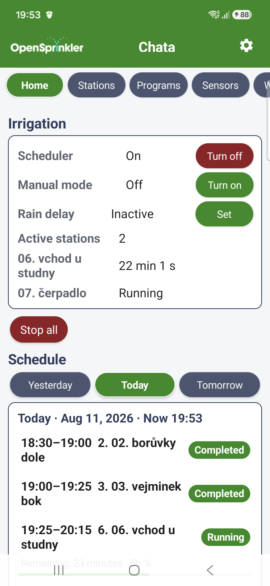
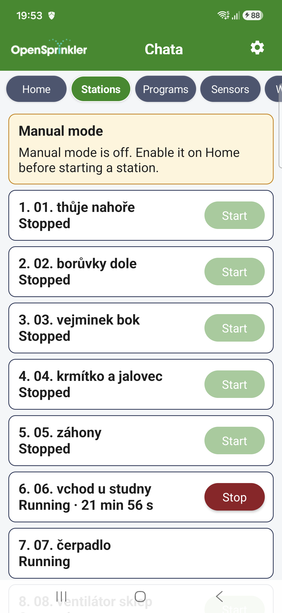
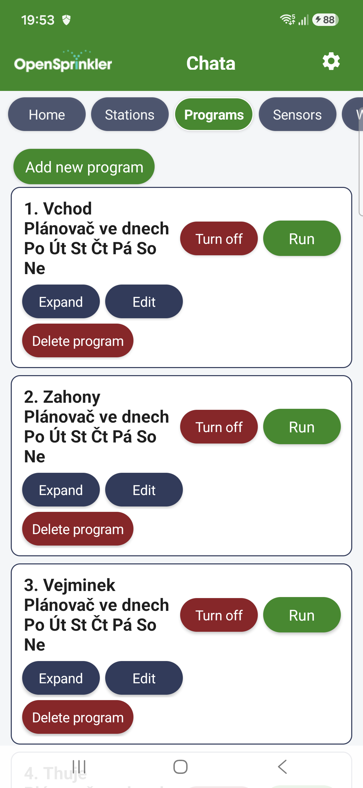
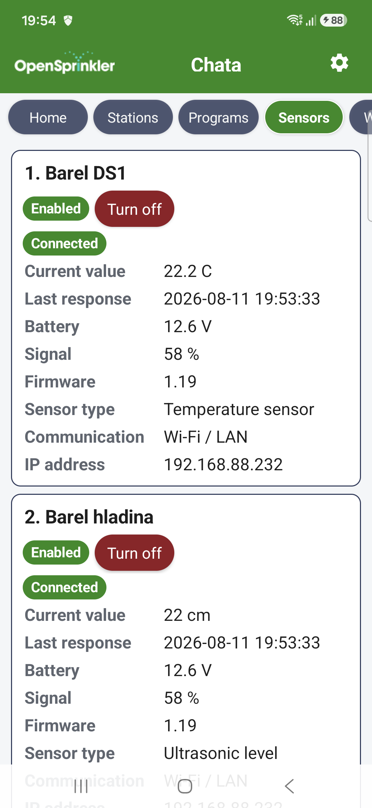
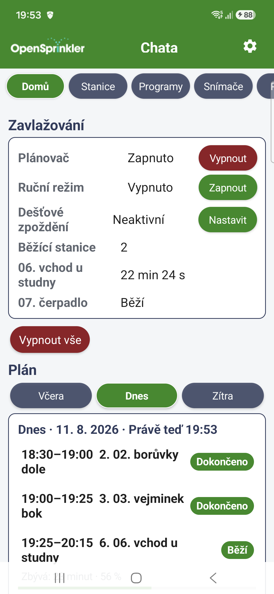
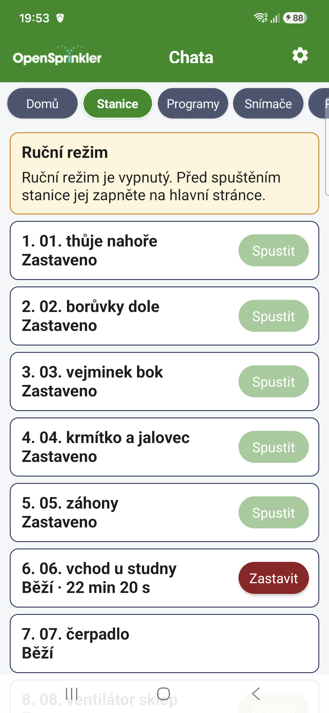
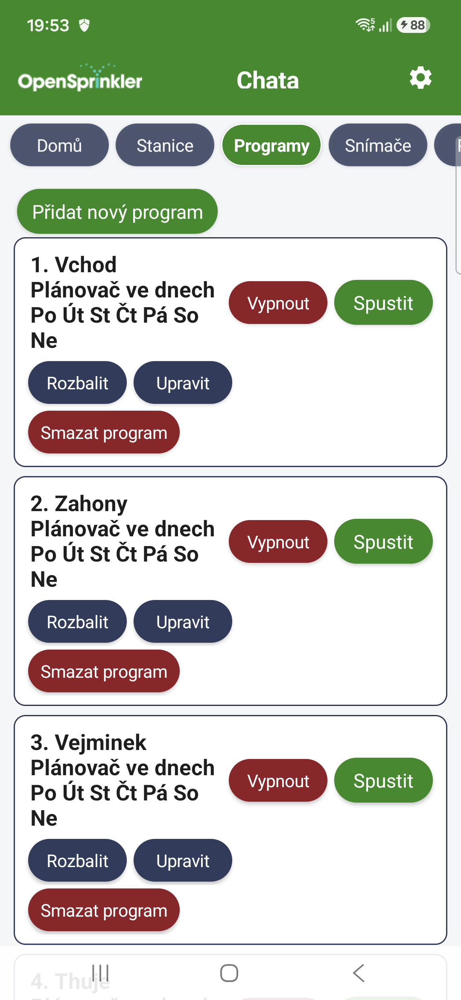
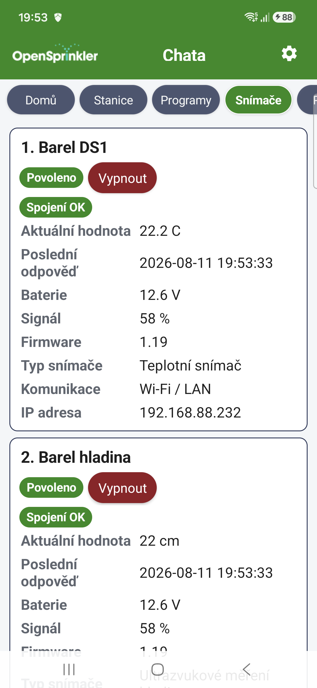

# OSPy Project
Open Sprinkler Python [Git-Hub source](https://github.com/martinpihrt/OSPy)

# OSPy Mobile APP
Android client for the OSPy `/api/v1`. App on [Google store](https://play.google.com/store/apps/details?id=com.pihrt.ospy.mobile)

Current source version: **0.3.33** (`versionCode 40`).

## Screenshots

### English

   

### Čeština

   

## Included in version 0.3.33
- Split installed plug-ins into expandable Running, Stopped and No operating data groups, with the number of plug-ins shown in every group heading. Running plug-ins with operating data are expanded by default; the other groups are collapsed.
- Kept the existing automatic 10-second refresh while a plug-in's operating data is expanded.
- Added the new group labels in every supported application language and increased the Android package version to `0.3.33` (`versionCode 40`).

Authentication remains automatic: the 15-minute access token is refreshed without asking for a password or 2FA. OSPy controls the refresh-token lifetime; its current sliding 30-day window renews after every successful refresh, so regularly connected installations stay signed in indefinitely.

## Included in version 0.3.32
- Automation Rules push notifications now include the evaluated value, comparison and configured limit, so trigger, reminder and recovery messages explain why the rule changed state.
- Increased the Android package version to `0.3.32` (`versionCode 39`).

## Included in version 0.3.31
- Added a dedicated Automation Rules notification category, localized triggered, repeated, recovery and test messages, and the actual rule name supplied in structured push data.
- Added a read-only Service outages card to System with localized active, scheduled and ended states and local date/time formatting. Outages remain managed by the authoritative OSPy Programs page.
- Added all new interface and notification strings in every supported application language and increased the Android package version to `0.3.31` (`versionCode 38`).

This version requires matching OSPy Mobile API support for the `automation` push category and read-only `/service-outages` endpoint.

## Included in version 0.3.29
- Home Yesterday now reads actual completed station history for the selected OSPy-local day, while Today and Tomorrow continue to show the current or predicted schedule.
- Replaced the separate Scheduler and Manual mode state/action rows with OSPy-style two-state switches for Scheduler On/Off and Operating mode Scheduler/Manual.
- Localized the scheduler-disabled timeline reason and the empty Yesterday-history message in every supported language, and increased the Android package version to `0.3.29` (`versionCode 36`).

This version requires matching OSPy Mobile API v1 support for the date-filtered `/logs/runs` history endpoint.

## Included in version 0.3.28
- Updated Android 15 edge-to-edge handling to rely on the platform-enforced layout and apply system-bar and display-cutout insets without retaining compatibility code that uses deprecated window APIs.
- Replaced manual Base64 bitmap decoding with lifecycle-aware Glide loading, resizing and memory management for plug-in images.
- Explicitly removed the transitively contributed Advertising ID and advertising-attribution permissions because the application does not use advertising services, and increased the Android package version to `0.3.28` (`versionCode 35`).

Before publishing this version, set the Google Play Console Advertising ID declaration to **No** for every active release track because the application does not use the advertising identifier.

## Included in version 0.3.27
- Added pull-to-refresh to Home, Stations, Programs, Sensors, Weather, Logs, Diagnostics and Plug-ins, and added automatic ten-second refresh while a plug-in operating-data panel remains expanded.
- Added native Weather Dashboard radial gauges that use the configured values, units, scale ticks and colored limits, with the configured text mode retained as an alternative.
- Replaced the Astro history chart and irrelevant range buttons with a fixed 24-hour day/night timeline showing sunrise, sunset and current time.
- Corrected Wind Speed Monitor trend rendering so the API values `up` and `down` display as rising and falling instead of waiting for data.
- Updated the in-app help in every supported language and increased the Android package version to `0.3.27` (`versionCode 34`).

## Included in version 0.3.26
- Added Firebase Analytics, enabled by default, for aggregate application usage and stability measurement. Advertising ID collection and ad-personalization signals are disabled; OSPy addresses, installation and station names, credentials, tokens and notification contents are not logged as custom analytics events.
- Updated the Firebase Android BoM to `34.17.0`, verified the Firebase Android application configuration and increased the Android package version to `0.3.26` (`versionCode 33`).

Before publishing this version, update the Google Play Data safety form and the application's privacy information to disclose Firebase Analytics collection.

## Included in version 0.3.25
- Added optional Android text-to-speech for localized OSPy notifications. Speech is disabled by default and can announce station start and stop events or every enabled notification category without restarting the application.
- Speech uses the application language and follows notification category filters and deduplication. A live status reports initialization, readiness, speaking, success, missing voice data, an unsupported language or a speech-service error, and a test action verifies the installed voice immediately.
- Added all speech settings in every supported language and increased the Android package version to `0.3.25` (`versionCode 32`).

## Included in version 0.3.24
- Added complete Spanish, French, Italian, Serbian, Russian, Danish, Simplified Chinese, Japanese and Korean Android resources. All 488 strings and plural resources are available in every supported language, including application help, notifications, API errors and program controls.
- Added the nine languages to Android per-app language settings, strengthened translation validation for the `zh-CN` resource qualifier and added a reproducible translation generator that preserves format placeholders, product names and protocol terms.
- Increased the Android package version to `0.3.24` (`versionCode 31`).

## Included in version 0.3.23
- Added a fully localized in-app help screen at the bottom of Application settings. It explains Home, Stations, Programs, Sensors, Weather, Logs, Diagnostics, Plug-ins, System and application settings, including discoverable short-tap and long-press station controls.
- Changed the System backup list to a collapsed expandable card, so the available backup files are loaded and displayed only when requested.
- Increased the Android package version to `0.3.23` (`versionCode 30`).

## Included in version 0.3.22
- Added timed manual station starts: a short tap starts without a time limit, while touching and holding Start opens a localized minutes-and-seconds dialog and shows the live countdown until OSPy stops the station automatically.
- Added validation tests, all five application translations and increased the Android package version to `0.3.22` (`versionCode 29`).

This feature requires the matching OSPy Mobile API v1 server support for optional `duration_seconds` on direct station starts.

## Included in version 0.3.21
- Reworked API authentication around one shared access session per saved OSPy installation. Foreground screens, live notifications, fallback polling and push registration reuse the same short-lived access token and perform a single serialized refresh instead of repeatedly rotating the saved token.
- Removed redundant push re-registration from every 15-minute notification poll; application start, pairing, Firebase token changes, reboot and notification preference changes still synchronize the subscription.
- Added the user water-level adjustment to Home with the effective combined OSPy value, localized validation and a one-tap reset to 100 percent.
- Program cards are grouped by the native OSPy program group, creation and editing select `group_id`, and each group can postpone or cancel its next scheduled occurrence with Android date and time pickers.
- Added English, Czech, German, Polish and Slovak strings, regression tests for shared-session decisions and increased the Android package version to `0.3.21` (`versionCode 28`).

The matching OSPy server exposes the water-level fields, program membership and postponement endpoints through Mobile API v1. It also keeps access tokens already in flight valid across normal refresh rotation until their short expiry, while explicit logout, renewed pairing and device revocation remain immediate.

## Included in version 0.3.20
- Replaced R8-obfuscated Firebase exception names such as `ed` with stable push-registration diagnostic codes.
- Added localized and actionable diagnostics for rejected App Check attestation, temporary rate limiting, request timeout, network failure and unexpected errors without exposing tokens or credentials.
- Added regression tests for push-registration error classification.
- Increased the Android package version to `0.3.20` (`versionCode 27`).

## Included in version 0.3.19
- Updated AndroidX Activity and Fragment to current stable releases instead of inheriting obsolete minimum versions from Google Play services.
- Migrated system-bar handling to AndroidX edge-to-edge APIs and current window insets so the interface remains correctly padded on recent Android versions.
- Migrated the release build to the Android Gradle Plugin 9.3 optimization DSL, enabling R8 code optimization and optimized resource shrinking together.
- Added a localized push-registration diagnostic panel to application settings. It shows the last safe registration stage, attempt time, HTTP status and stable error code without displaying FCM tokens, App Check tokens, passwords or subscription secrets.
- Added a manual **Retry push registration** action and automatic retry after every confirmed foreground OSPy connection and periodic background notification job.
- Registration failures are written to Android logcat under the `OSPyPush` tag instead of being silently discarded.
- Increased the Android package version to `0.3.19` (`versionCode 26`).

For rapid tests that preserve an existing production installation, use the Google Play internal testing track. An internal-track App Bundle is signed with the same Play App Signing key as production, can update the installed application in place and preserves the saved OSPy installations. A directly built local APK uses a different signing key and cannot replace the Play-installed application without uninstalling it first.

Debug builds use the Firebase App Check debug provider and release builds always use Play Integrity. To test directly through ADB, build `assembleDebug`, start the application once, copy the `DebugAppCheckProvider` token from logcat and register it in Firebase Console under App Check / Android application / Manage debug tokens. Never commit or distribute a debug token. After the one-time switch from the Play-signed application, later debug APKs can be installed repeatedly with `adb install -r app/build/outputs/apk/debug/app-debug.apk` without clearing the debug application data.

## Included in version 0.3.18
- Re-authenticating an existing saved installation sends its persistent `device_id`, replaces the rotating login session in place and no longer creates another paired-device row in OSPy.
- Adding the same normalized OSPy address and user again also reuses the existing local identity. A genuinely new profile, application reinstall or different phone still receives a new identity.
- Added a localized **Sign in again** action to every saved installation.
- Increased the Android package version to `0.3.18` (`versionCode 25`).

## Included in version 0.3.17
- Added immediate background delivery through Firebase Cloud Messaging with high-priority data messages. The existing 15-minute JobScheduler polling remains available as a fallback.
- Added Firebase App Check with the Play Integrity provider. A phone registers with the configured HTTPS relay only after it has authenticated to its own OSPy installation, and the relay registration never exposes the OSPy password or refresh token.
- Every saved OSPy installation discovers the relay through its authenticated `/api/v1/push` endpoint. FCM token refresh, device reboot, application replacement, pairing and notification-preference changes automatically synchronize the subscription.
- Push messages are matched to the persistent OSPy installation ID, deduplicated against the existing notification cursor and rendered through the same localized notification-code mapping as live and polled events.
- Increased the Android package version to `0.3.17` (`versionCode 24`).

## Included in version 0.3.16
- Replaced the blank reconnect screen with the OpenSprinkler logo, a progress indicator and localized connection status while the last installation is being checked.
- Kept saved installation selection available when automatic reconnection fails or takes too long.
- Increased the Android package version to `0.3.16` (`versionCode 23`).

## Included in version 0.3.15
- Added confirmed deletion for every irrigation program.
- Replaced raw JSON/minute-pair schedule fields with localized interval, weekday, time, priority, cycle-day, date and date/time controls.
- Made notification startup polling immediate, preserved recent events during first synchronization, and visibly reports when Android blocks permission.
- Installation addresses accept DNS host names or IP addresses, with an optional port; HTTPS is assumed when the scheme is omitted.
- Increased the Android package version to `0.3.15` (`versionCode 22`).

## Included in version 0.3.14
- Added creation of native OSPy programs. The app first asks for the scheduling type and then opens the matching form instead of silently creating a custom schedule.
- Added type-aware editing for all seven supported OSPy scheduling models: selected days (simple/advanced), repeating (simple/advanced), weekly advanced, custom and weekly weather based.
- Editing preserves the existing program type and its matching `type_data` shape. Unknown future types remain unsupported instead of being converted to custom.
- Program forms validate required stations, weekdays, dates, times, positive values, intervals and weather priority moments before sending the request.
- A failed save leaves the editor open and displays a localized, actionable reason returned through the stable API error code and details.
- Weekly weather pause ratio is displayed as a percentage while the API value remains the native OSPy decimal ratio (`0.5` means 50%).
- Increased the Android package version to `0.3.14` (`versionCode 21`).

The matching OSPy server update validates and builds a complete program on a detached instance before committing it. This prevents a rejected create or edit request from partially renaming a program, changing its enabled state or converting its scheduling type. Use the current OSPy `/api/v1` implementation with this app version.

## Included in version 0.3.13
- Editing a saved installation preserves the newest rotating refresh token, so changing its display name, address or certificate setting no longer invalidates the connection.
- Structured authentication, API and network failures are localized instead of exposing raw English exception text or connection details.
- Server notifications are rendered from stable notification codes and structured data. Known station, rain, diagnostics and update events no longer depend on the server's English title or message.
- Saved installations are probed concurrently at startup, reducing the delay when one or more configured OSPy addresses are unavailable.
- System Update plug-in cards localize their title, metric names, Boolean values, update channels and operation states.
- Audited the English, Czech, German, Polish and Slovak resources for missing keys, placeholder compatibility and malformed XML.

## Included in version 0.3.11
- Centered the installation name in the free toolbar area between the OpenSprinkler logo and the settings button. The title now uses the same 28 dp visual height as the logo and a smaller 18 sp font.
- Fixed notification category routing: station start, station stop, rain, diagnostics and update server events now respect their matching settings instead of falling through to Other or being discarded.
- Added native Android JobScheduler background polling of the persistent API v1 notifications feed. Notifications continue to be collected when the activity is not open; periodic background execution is scheduled every 15 minutes and survives reboot/app replacement. Live in-app polling remains active while the app process is running.
- Added persistent per-installation notification cursors to prevent duplicate or historical notification floods.

## Included in version 0.3.10
- Added the supplied OpenSprinkler logo before the installation name. The branded toolbar remains visible on every installation tab.
- Added pull-to-refresh to the Home tab. Pulling down from the top performs the same complete reload as leaving Home and returning to it.
- Preserved the 0.3.9 fix that keeps a rain-blocked program visible until its planned end while rain delay remains active.

## Included in version 0.3.8
- Fixed: Both android:windowLightNavigationBar requires API level 27. The attribute has been moved from values/styles.xml to values-v27/styles.xml. Android 8.0 with API 26 will now use a compatible base theme. Both light and dark themes now use common base styles. Removed all deprecated options from gradle.properties that were listed in the Git-Hub log.
- Added recommended: android.dependency.excludeLibraryComponentsFromConstraints=true. Removed unnecessary Foojay Java toolchain plugin. GitHub Actions now always save: HTML Lint report, text Lint report, SARIF report, Gradle problems report. Debug APK will be uploaded even if it builds and then only Lint fails.
- Added missing TRANSLATIONS.md.
- Updated change documentation.

## Included in version 0.3.7
- Application authentication is enabled by default and can be disabled in the gear-menu settings. Android 10 and newer offer biometrics or the device credential; Android 8 and 9 use the secure device-credential screen.
- A light/dark theme switch applies a complete runtime colour palette to the native interface, cards, forms, status panels and plug-in charts.
- Phone notifications can be enabled separately for station start, station stop, rain protection, diagnostics, updates and other OSPy events.
- The System screen keeps update controls inside the OSPy information card, hides installation when no update is available and follows the asynchronous API operation until completion or failure.
- After an OSPy update and restart, the app reconnects, reloads the update state and refreshes the System screen automatically.
- Stable status codes such as `ok`, `warn`, `degraded`, `failed` and `unknown` are localized and use consistent status colours in every supported language.

## Included in version 0.3.6
- Plug-in cards show history controls only when the server supplies an actual graph, explicit history metadata or at least one measured series point.
- The System screen lists retained OSPy backups and downloads the selected ZIP through Android's system file picker.
- Administrators can confirm and start installation from the update channel already selected in the OSPy System Update plug-in.
- Binary backup downloads use the same access-token refresh and per-installation HTTPS certificate policy as JSON API requests.

## Included in version 0.3.5
- The Home screen shows a persistent localized connection warning after polling loses OSPy and includes the time of the last successful response.
- The duplicate Home refresh row was removed, the OSPy version was moved below the planner and rain-delay blocking reasons are localized.
- Native plug-in telemetry now localizes the Astro, real-time synchronization, system information, weather-calculation and Shelly metric labels and values.
- All user-visible Android and Keystore messages were audited against the English, Czech, German, Polish and Slovak XML catalogs.

## Included in version 0.3.4
- Rotating the device keeps the already unlocked application session and does not request biometrics or the device credential again.
- Disabled stations are omitted from the native Stations screen, matching the OSPy web interface.
- A disabled program can still be started manually while its automatic schedule remains disabled.
- Virtual water-meter labels supplied by OSPy identify the first and second master instead of being replaced by generic application labels.

## Included in version 0.3.3
- Station countdowns use localized hours, minutes and seconds.
- Program details show a readable start time, explicit duration and pause units, and localized weekday names; the editor arranges all seven weekdays across two rows.
- Every native plug-in chart supports 1 hour, Today, 7 days, Month, Year and a custom date range. Today is the default. Points use their real timestamps, empty ranges are identified clearly and the last available sample is shown.
- Long plug-in histories are requested from OSPy in a bounded range and are reduced on the server while preserving bucket minima and maxima.

## Included in version 0.3.2
- German, Polish and Slovak application resources.
- Smooth refresh home page
- Schedule days

## Included in version 0.3.1
- Multiple saved OSPy installations, for example Home, Cottage and Greenhouse.
- Refresh tokens encrypted by an AES-GCM key stored in Android Keystore.
- Application unlock with biometrics or the device credential when configured.
- Password and OSPy 2FA pairing; short-lived access tokens stay in memory.
- Native Home, Stations, Programs, Sensors, Weather, Logs, Diagnostics, Plug-ins and System screens.
- Immediate station start/stop, Stop All and program run actions.
- Update check, system-backup creation and OSPy restart actions.
- Foreground live-change polling through the documented SSE fallback, including local Android notifications for OSPy notification events.
- English, Czech application resources.
- Compact navigation with a clearly highlighted active section and native, localized cards for weather, event logs, diagnostics and update status.
- Resilient Home and sensor rendering when an optional API field is unavailable.
- Correct first launch after the Android notification-permission prompt.
- Live Home and station state refresh, including a known countdown or an explicit running state for direct starts without a scheduled end.
- Editing of a saved installation name, address and per-installation unverified-certificate choice.
- A gear in the top application bar opens application settings with the notification switch, saved OSPy systems, app version and official project, plug-in, source-code and Google Play links. The OSPy System tab is reserved for server status and administrator actions.
- Native sensor and plug-in cards can enable or disable an item through the protected API. Plug-in activation still requires prior permission approval and passes through OSPy's compatibility and lifecycle checks.
- Home refreshes automatically every ten seconds, shows the last successful server refresh and reloads immediately after a control action. Background refreshes update the existing values and timeline rows in place, so the Home screen does not disappear or flash during polling.
- Home controls the scheduler and manual mode. Rain delay accepts a duration selected by the user, displays the remaining time and can be cancelled.
- Initial live-event synchronization does not replay old weather or diagnostic notifications after login.
- Sensor cards use the typed API display contract, showing only the relevant measured value and unit plus connection, firmware, communication and address information instead of legacy arrays and numeric type codes.
- Installation cards keep the name and address on separate rows with their actions below, so long local HTTPS addresses remain readable.
- Home replaces the duplicate weather cards with a live, normalized watering timeline showing scheduled, running, blocked and completed station work.
- Programs show their stations and schedule details, support enable/disable and run actions, and provide native creation and type-specific editing for every scheduling model currently supported by Mobile API v1.
- Logs can switch between the OSPy event log and station-run history.
- Official plug-ins can expose optional read-only native metric and chart cards through the documented JSON-only plug-in adapter contract.
- Home uses the current local OSPy day, keeps only a compact recent/running/upcoming timeline and shows running progress and remaining time.
- Native plug-in cards can be collapsed again, localize their known metric names in the app, show chart legends and time bounds, and render a bounded current radar image.
- Optional network-aware installation selection prefers a saved private address on Wi-Fi and a public address outside Wi-Fi. The last reachable installation can be opened automatically after application unlock.

The app uses Android platform APIs, `org.json`, Firebase Cloud Messaging, Firebase App Check and Firebase Analytics. Analytics is enabled by default and limited to Firebase's automatic aggregate application usage and stability measurement. Advertising ID collection and ad-personalization signals are disabled, and the app does not log OSPy addresses, installation or station names, credentials, tokens or notification contents as custom analytics events. The app contains no advertising SDK. Immediate notifications use the separately deployed OSPy push relay; normal control and monitoring continue to communicate directly with the user's OSPy installation.

## Localization

The app uses native Android string resources and includes English, Czech, German, Polish and Slovak. Android 13 and newer can select a language specifically for OSPy Mobile. See [TRANSLATIONS.md](TRANSLATIONS.md) for the POEditor, Weblate and Android Studio workflow and automated validation.

## Build

Install Android Studio with Android SDK 37 and JDK 17. Open this directory, allow Gradle to synchronize and run or build the `app` configuration. GitHub Actions also builds a debug APK on every push and pull request using JDK 17 and the Gradle version pinned by the repository wrapper. The workflow retains the debug APK and complete HTML, text and SARIF Lint reports for diagnosis.

The repository intentionally does not contain `local.properties`, SDK files, signing keys or built APK files. The checked-in `app/google-services.json` contains the public Firebase project and application identifiers required by the Android build; it is not a service-account credential and cannot authorize server-side FCM sending.

## Connection and security

Update OSPy to a version that provides `/api/v1`. Add the full HTTP(S) address, user name, password and optional 2FA code. Use HTTPS whenever OSPy is reachable outside a trusted private network. Cleartext HTTP remains allowed for existing LAN-only OSPy installations and is visibly present in the saved address.

OSPy commonly uses a locally generated HTTPS certificate that Android cannot verify. The pairing form therefore offers an explicit per-installation **Trust an unverified HTTPS certificate** option. It disables certificate-chain and host-name verification only for that saved installation and is off by default. Enable it only for your own OSPy on a trusted private network. Use a publicly trusted certificate for any installation exposed through the Internet. If Android cannot resolve a local name such as `ospy`, enter the device's local IP address instead.

Removing an installation deletes its locally protected refresh token. Use the OSPy paired-device endpoint or OSPy web administration to revoke a lost device. Android backup is disabled so tokens cannot leave the device through application backup.

Production push registration uses Play Integrity and therefore must be tested with a build installed through Google Play testing or production. A directly installed debug APK can still use the application and fallback polling, but it cannot obtain a production App Check assertion. Google Play updates preserve saved installations. Direct APK and Google Play builds use different signing identities and Android cannot migrate protected application data through an uninstall or a switch between those identities.

## Architecture

- `ApiClient` implements JSON requests, automatic token refresh and rotation.
- `KeystoreStore` encrypts the saved installation list.
- `InstallationStore` supports multiple OSPy systems.
- `LiveUpdates` uses `/changes` as the reconnect-safe fallback to `/stream`.
- `NotificationCenter` maps stable server notification codes to native localized Android notifications.
- `PushRegistrationManager` binds each authenticated OSPy installation to its FCM token through the configured relay and keeps notification preferences synchronized.
- `OSPyFirebaseMessagingService` receives, validates, associates and deduplicates immediate data notifications while the application UI is closed.
- `MainActivity` renders native Android views and sends explicit API actions.

The complete server-side contract is documented in the [OSPy Mobile API v1 reference](https://github.com/martinpihrt/OSPy/blob/master/api/docs/Mobile_API_v1.md) and exposed by every installation at `/api/v1/openapi.json`.
